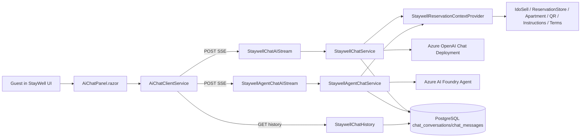

# StayWell ChatAI - dokumentacja techniczna

## Cel
Moduł `ChatAI` dostarcza asystenta dla gościa w aplikacji `StayWell`. Implementacja obsługuje dwa tryby rozmowy:

1. `Classic` - bezpośrednie wywołanie modelu chat przez Azure OpenAI.
2. `Agent` - wywołanie agenta w Azure AI Foundry, z konwersacją utrzymywaną po stronie Foundry.

Oba tryby:

- pobierają kontekst rezerwacji i apartamentu z systemów Rentoom,
- budują prompt systemowy na podstawie danych rezerwacji,
- streamują odpowiedź do frontendu przez SSE,
- zapisują historię rozmowy do PostgreSQL,
- limitują liczbę zapytań per rezerwacja.

## Zakres rozwiązania
Rozwiązanie jest rozdzielone na trzy warstwy:

1. `StayWell` - frontend Blazor WebAssembly, który wysyła zapytanie i odbiera streaming SSE.
2. `Api` - Azure Functions z endpointami HTTP dla streamingu i odczytu historii.
3. `RentoomBooking.ChatAI` - osobny projekt domenowo-integracyjny odpowiedzialny za konfigurację, prompt, orkiestrację rozmowy, integrację z Azure OpenAI / Azure AI Foundry i zapis historii.

## Lokalizacja kodu
### Backend / Functions
- `Api/Program.cs`
- `Api/ChatAI/StaywellChatStreamFunction.cs`
- `Api/ChatAI/StaywellAgentChatStreamFunction.cs`
- `Api/ChatAI/StaywellChatHistoryFunction.cs`
- `Api/ChatAI/StaywellReservationContextProvider.cs`

### Logika ChatAI
- `RentoomBooking.ChatAI/RentoomBooking.ChatAI.csproj`
- `RentoomBooking.ChatAI/Services/StaywellChatService.cs`
- `RentoomBooking.ChatAI/Services/StaywellAgentChatService.cs`
- `RentoomBooking.ChatAI/Services/AzureFoundryStaywellChatClient.cs`
- `RentoomBooking.ChatAI/Services/FoundryAgentStaywellChatClient.cs`
- `RentoomBooking.ChatAI/Services/StaywellPromptBuilder.cs`
- `RentoomBooking.ChatAI/Services/MemoryChatRateLimiter.cs`
- `RentoomBooking.ChatAI/Data/ChatAIDbContext.cs`
- `RentoomBooking.ChatAI/Repositories/ChatConversationRepository.cs`
- `RentoomBooking.ChatAI/Repositories/ChatMessageRepository.cs`

### Frontend StayWell
- `StayWell/Program.cs`
- `StayWell/Services/AiChatClientService.cs`
- `StayWell/Components/ModalContent/AiChatPanel.razor`

## Architektura wysokiego poziomu


## Tryby działania
### 1. Classic
Tryb `Classic` używa klienta `AzureFoundryStaywellChatClient`, który tak naprawdę wykonuje streaming do deploymentu chatowego Azure OpenAI.

Charakterystyka:

- do modelu wysyłany jest `system prompt`, historia rozmowy i bieżące pytanie użytkownika,
- `conversationId` po stronie API jest lokalnym `Guid` zapisanym w PostgreSQL,
- historia rozmowy jest odtwarzana z lokalnej bazy,
- model nie utrzymuje własnego stanu konwersacji poza tym, co backend mu przekaże.

### 2. Agent
Tryb `Agent` używa klienta `FoundryAgentStaywellChatClient` i endpointów Azure AI Foundry `openai/v1/conversations` oraz `openai/v1/responses`.

Charakterystyka:

- przy pierwszej wiadomości tworzona jest zdalna konwersacja Foundry,
- system prompt jest przekazywany tylko raz, podczas tworzenia konwersacji,
- kolejne wiadomości używają identyfikatora zdalnej konwersacji Foundry,
- lokalna baza PostgreSQL przechowuje jedynie audit trail i mapowanie po `reservationToken + foundryConversationId`.

## Rejestracja w DI i konfiguracja runtime
Rejestracja odbywa się w `Api/Program.cs`.

### DbContext
`ChatAIDbContext` korzysta z tego samego połączenia PostgreSQL co główna baza bookingowa:

- `AddDbContextFactory<ChatAIDbContext>(options => options.UseNpgsql(postgresConnectionString));`

Źródło połączenia:

- `POSTGRES_RENTOOM_BOOKING_DB_LOCAL`
- fallback z helpera `PostgresConnectionStringProvider`

### Serwisy ChatAI
W DI rejestrowane są:

- `IChatConversationRepository -> ChatConversationRepository`
- `IChatMessageRepository -> ChatMessageRepository`
- `IStaywellChatClient -> AzureFoundryStaywellChatClient`
- `IStaywellAgentChatClient -> FoundryAgentStaywellChatClient`
- `IPromptBuilder -> StaywellPromptBuilder`
- `IReservationContextProvider -> StaywellReservationContextProvider`
- `IStaywellChatService -> StaywellChatService`
- `IStaywellAgentChatService -> StaywellAgentChatService`
- `IChatRateLimiter -> MemoryChatRateLimiter`

## Konfiguracja aplikacyjna
### Sekcja `StaywellChat`
Używana przez tryb `Classic`.

Wymagane pola:

- `Endpoint`
- `ApiKey`
- `DeploymentName`

Parametry opcjonalne / domyślne:

- `MaxMessageLength` - domyślnie `2000`
- `MaxHistoryMessages` - domyślnie `15`
- `MaxRequestsPerMinute` - domyślnie `12`
- `StreamingTimeoutSeconds` - domyślnie `90`

Kod opcji: `RentoomBooking.ChatAI/Contracts/StaywellChatOptions.cs`

### Sekcja `StaywellAgentChat`
Używana przez tryb `Agent`.

Wymagane / istotne pola:

- `ProjectEndpoint`
- `AgentName`
- `ToolboxEndpoint` - w obecnej implementacji nie jest wysyłany do requestów, ale może służyć do wyliczenia `ProjectEndpoint`
- `TokenScope` - domyślnie `https://ai.azure.com/.default`

Parametry opcjonalne / domyślne:

- `MaxMessageLength` - domyślnie `2000`
- `MaxHistoryMessages` - domyślnie `15`
- `MaxRequestsPerMinute` - domyślnie `12`
- `StreamingTimeoutSeconds` - domyślnie `90`

Kod opcji: `RentoomBooking.ChatAI/Contracts/StaywellAgentChatOptions.cs`

### Fallback `AzureOpenAi_general`
Jeżeli `StaywellChat.Endpoint`, `StaywellChat.ApiKey` albo `StaywellChat.DeploymentName` nie są ustawione, `Api/Program.cs` próbuje pobrać te wartości z sekcji `AzureOpenAi_general`.

To oznacza, że dla trybu `Classic` istnieją dwa poprawne warianty konfiguracji:

1. dedykowana sekcja `StaywellChat`,
2. fallback do wspólnej sekcji `AzureOpenAi_general`.

### Konfiguracja lokalna
W repo istnieje `Api/local.settings.json`, w którym zdefiniowane są klucze konfiguracyjne dla ChatAI.

Do dokumentacji i wdrożeń nie należy kopiować realnych sekretów. Używaj szablonu:

```json
{
  "Values": {
    "StaywellChat:Endpoint": "https://<azure-openai-resource>.cognitiveservices.azure.com/",
    "StaywellChat:ApiKey": "<secret>",
    "StaywellChat:DeploymentName": "<deployment-name>",
    "StaywellChat:ApiVersion": "<optional>",

    "StaywellAgentChat:ProjectEndpoint": "https://<region>.services.ai.azure.com/api/projects/<project>",
    "StaywellAgentChat:AgentName": "staywell-events-mvp",
    "StaywellAgentChat:ToolboxEndpoint": "https://<region>.services.ai.azure.com/api/projects/<project>/toolboxes/<toolbox>/mcp?api-version=v1"
  },
  "ConnectionStrings": {
    "POSTGRES_RENTOOM_BOOKING_DB_LOCAL": "Host=<host>;Port=5432;Database=<db>;Username=<user>;Password=<password>"
  },
  "StaywellChat": {
    "Endpoint": "https://<azure-openai-resource>.cognitiveservices.azure.com/",
    "ApiKey": "<secret>",
    "DeploymentName": "<deployment-name>",
    "ApiVersion": "<optional>"
  },
  "StaywellAgentChat": {
    "ProjectEndpoint": "https://<region>.services.ai.azure.com/api/projects/<project>",
    "AgentName": "staywell-events-mvp",
    "ToolboxEndpoint": "https://<region>.services.ai.azure.com/api/projects/<project>/toolboxes/<toolbox>/mcp?api-version=v1"
  }
}
```

## Uwierzytelnienie do usług AI
### Classic
Tryb `Classic` używa klucza API:

- `AzureOpenAIClient(new Uri(endpoint), new AzureKeyCredential(apiKey))`

Wymagania:

- aktywny Azure OpenAI resource,
- deployment chatowy zgodny z oczekiwanym modelem,
- poprawny endpoint i API key.

### Agent
Tryb `Agent` używa `DefaultAzureCredential` i tokenu Bearer pobieranego dla scope:

- `https://ai.azure.com/.default`

Wymagania:

- środowisko uruchomieniowe musi mieć tożsamość zdolną uzyskać token AAD,
- ta tożsamość musi mieć dostęp do Azure AI Foundry Project,
- agent `AgentName` musi już istnieć w Foundry.

Praktycznie oznacza to, że środowisko Azure powinno korzystać z Managed Identity albo konta serwisowego dostępnego przez `DefaultAzureCredential`.

## Endpointy HTTP
### 1. Streaming classic
- metoda: `POST`
- route: `/api/staywell/chatai/stream`
- function: `StaywellChatAIStream`

### 2. Streaming agent
- metoda: `POST`
- route: `/api/staywell/chatai/agent/stream`
- function: `StaywellAgentChatAIStream`

### 3. Historia rozmowy
- metoda: `GET`
- route: `/api/staywell/chatai/history`
- function: `StaywellChatHistory`

Parametry query dla historii:

- `reservationToken`
- `conversationId`
- `mode=classic|agent`

## Kontrakt request/response
### Request do streamingu
DTO:

```json
{
  "message": "Jak wejść do apartamentu?",
  "reservationToken": "<reservation-token>",
  "reservationId": 123456,
  "conversationId": "<guid albo foundryConversationId albo null>"
}
```

Odpowiada rekordowi:

- `ChatRequestDto(string Message, string ReservationToken, int ReservationId, string? ConversationId)`

### SSE events
Backend streamuje zdarzenia SSE:

1. `event: chunk`
   payload:
```json
{ "text": "fragment odpowiedzi" }
```

2. `event: done`
   payload:
```json
{ "isDone": true, "conversationId": "<id>" }
```

3. `event: error`
   payload:
```json
{ "message": "opis błędu" }
```

### Response historii
```json
{
  "conversationId": "<id>",
  "messages": [
    {
      "role": "user",
      "content": "...",
      "createdAt": "2026-04-29T18:00:00Z"
    },
    {
      "role": "assistant",
      "content": "...",
      "createdAt": "2026-04-29T18:00:01Z"
    }
  ]
}
```

## Przepływ backend - classic
### Krok 1. Wejście przez Azure Function
`StaywellChatStreamFunction`:

- czyta body,
- deserializuje `ChatRequestDto`,
- ustawia odpowiedź `text/event-stream`,
- przekazuje obsługę do `IStaywellChatService`.

### Krok 2. Walidacja i rate limit
`StaywellChatService`:

- waliduje `ReservationId`, `Message`, `ConversationId`,
- sprawdza rate limit per `ReservationId`,
- odrzuca request po przekroczeniu limitu.

Rate limiter:

- `MemoryChatRateLimiter`
- okno: `1 minuta`
- klucz: `chat-rate:{reservationId}`
- storage: `IMemoryCache`

Uwaga architektoniczna:

- to jest limiter in-memory, więc działa tylko na pojedynczej instancji procesu,
- przy wielu instancjach Functions limit nie jest globalnie współdzielony.

### Krok 3. Weryfikacja rezerwacji i budowa kontekstu
`StaywellReservationContextProvider`:

- pobiera rezerwację z IdoSell przez `IdoSellService.FetchReservationByIDFromIdoSellAsync`,
- odrzuca brakującą lub przeterminowaną rezerwację,
- pobiera dodatkowy kontekst z:
  - `IReservationStore`
  - `ApartmentRepository`
  - `RappQrMaintService`
  - `ArrivalInstructionsService`
  - `LockInstructionsService`
  - `CustomerTermsRepository`
- buduje `ReservationPromptContext`.

Budowane dane obejmują m.in.:

- dane gościa,
- status i daty pobytu,
- dane apartamentu,
- adres, miasto, kraj, GPS, Google Maps,
- instrukcje dotarcia,
- instrukcje wejścia,
- kody dostępu,
- Wi-Fi,
- parking,
- reguły pobytu,
- guidance dla pytań o miejsca w pobliżu.

### Krok 4. Budowa promptu systemowego
`StaywellPromptBuilder` buduje długi prompt markdownowy z:

- zasadami odpowiedzi,
- priorytetami źródeł odpowiedzi,
- formatting rules,
- pełnym kontekstem rezerwacji i apartamentu.

Najważniejsze zasady promptu:

- nie zgaduj danych, których nie ma w kontekście,
- odpowiadaj w markdown,
- dla instrukcji używaj list numerowanych,
- dla kodów i linków używaj bulletów,
- rozdzielaj `ApartmentDirectionsSummary` od `ArrivalInstructionsSummary`.

### Krok 5. Odtworzenie albo utworzenie rozmowy
Dla trybu classic:

- jeśli `ConversationId` jest puste, tworzony jest rekord `chat_conversations`,
- do `chat_messages` dopisywana jest wiadomość `system` z promptem,
- jeśli `ConversationId` istnieje, backend weryfikuje:
  - czy to poprawny `Guid`,
  - czy konwersacja istnieje,
  - czy należy do podanego `reservationToken`,
  - czy ma status `Active`.

### Krok 6. Wywołanie modelu
`AzureFoundryStaywellChatClient`:

- tworzy listę `ChatMessage`,
- dodaje `SystemChatMessage(systemPrompt)`,
- dodaje historię `user/assistant`,
- dodaje bieżące pytanie użytkownika,
- wywołuje `CompleteChatStreaming(messages)`.

Streaming jest przekazywany chunk po chunku do Function, a stamtąd do frontendu po SSE.

### Krok 7. Persist historii
Po zakończeniu streamingu backend zapisuje:

- wiadomość user,
- wiadomość assistant,
- aktualizację `UpdatedAt` konwersacji.

## Przepływ backend - agent
### Krok 1. Wejście przez Azure Function
`StaywellAgentChatStreamFunction` jest praktycznie odpowiednikiem classic, ale deleguje do `IStaywellAgentChatService`.

### Krok 2. Walidacja, rate limit i kontekst
Działa analogicznie do classic.

### Krok 3. Utworzenie lub odtworzenie konwersacji Foundry
`StaywellAgentChatService`:

- jeśli klient podał `ConversationId`, jest on traktowany jako `foundryConversationId`,
- jeśli nie podał, wywoływane jest `CreateConversationAsync(systemPrompt)`.

`FoundryAgentStaywellChatClient.CreateConversationAsync`:

- robi `POST {ProjectEndpoint}/openai/v1/conversations`,
- wysyła pojedynczy item typu `message`, zawierający prompt systemowy opakowany jako kontekst rozmowy,
- odbiera `id` zdalnej konwersacji Foundry.

### Krok 4. Audit trail w lokalnej bazie
Tryb agent nie mapuje 1:1 `conversationId` do `Guid` konwersacji lokalnej.

Zamiast tego:

- budowany jest `auditToken = {reservationToken}:agent:{foundryConversationId}`,
- jeśli nie ma jeszcze lokalnej konwersacji dla tego tokenu, tworzony jest rekord w `chat_conversations`,
- do `chat_messages` zapisywana jest systemowa wiadomość zawierająca:
  - `FoundryConversationId: ...`
  - pełny system prompt.

To pozwala:

- odtworzyć historię dla UI,
- zachować audyt lokalny,
- rozdzielić identyfikator konwersacji UI/Foundry od lokalnego `Guid` bazy.

### Krok 5. Streaming odpowiedzi agenta
`FoundryAgentStaywellChatClient.CompleteStreamingAsync`:

- robi `POST {ProjectEndpoint}/openai/v1/responses`,
- wysyła:
  - `agent_reference.name`
  - `conversation`
  - `input`
  - `stream = true`
- autoryzuje request Bearer tokenem z `DefaultAzureCredential`,
- odczytuje odpowiedź SSE,
- wyciąga tylko eventy typu `response.output_text.delta`.

### Krok 6. Persist historii
Po zakończeniu odpowiedzi backend zapisuje user + assistant do lokalnej bazy auditowej i odświeża `UpdatedAt` konwersacji auditowej.

## Model danych
### Tabela `chat_conversations`
Kolumny:

- `id uuid PK`
- `reservation_token text not null`
- `status text not null`
- `created_at timestamptz not null default NOW()`
- `updated_at timestamptz not null default NOW()`

Indeks:

- `idx_chat_conversations_reservation_updated_at(reservation_token, updated_at)`

### Tabela `chat_messages`
Kolumny:

- `id uuid PK`
- `conversation_id uuid FK -> chat_conversations.id`
- `role varchar(20) not null`
- `content text not null`
- `token_count int not null default 0`
- `created_at timestamptz not null default NOW()`

Indeks:

- `idx_chat_messages_conversation_created_at(conversation_id, created_at)`

Migracja inicjalna:

- `RentoomBooking.ChatAI/Migrations/20260416133909_ChatAI_Initial.cs`

## Historia rozmowy
Endpoint `GET /api/staywell/chatai/history` działa w dwóch trybach:

### Classic
- oczekuje `conversationId` jako `Guid`,
- sprawdza zgodność `reservationToken`,
- zwraca tylko role `user` i `assistant`.

### Agent
- oczekuje `conversationId` jako `foundryConversationId`,
- mapuje je na lokalny `auditToken = {reservationToken}:agent:{conversationId}`,
- zwraca historię z lokalnej konwersacji auditowej.

## Integracja z frontendem StayWell
### Rejestracja klienta HTTP
W `StayWell/Program.cs` klient `FunctionsApi` ma bazowy adres:

- lokalnie: `https://localhost:7238/api/`
- na produkcji: `<base-address>/api/`

To oznacza, że frontend oczekuje, iż Functions będą dostępne pod ścieżką `/api`.

### Komponent UI
`StayWell/Components/ModalContent/AiChatPanel.razor`:

- domyślnie ustawia tryb `Agent`,
- trzyma `conversationId` w Local Storage,
- rozdziela klucze storage dla `Classic` i `Agent`,
- odczytuje historię po wejściu do panelu,
- renderuje markdown dla odpowiedzi assistant,
- streamuje chunki na żywo do jednego placeholdera wiadomości assistant.

### Klucze Local Storage
- classic: `staywell:ai-chat:conversation:{token}`
- agent: `staywell:ai-chat:agent-conversation:{token}`

## Bezpieczeństwo i ograniczenia
### Mechanizm dostępu
Endpointy są oznaczone jako `AuthorizationLevel.Anonymous`.

Realna kontrola dostępu opiera się na:

- `reservationToken`,
- `reservationId`,
- weryfikacji aktywnej rezerwacji w `StaywellReservationContextProvider`,
- zgodności `reservationToken` z konwersacją historyczną.

### Ograniczenia obecnego podejścia
1. Rate limit jest lokalny dla instancji procesu.
2. Endpointy są anonimowe, więc bezpieczeństwo opiera się wyłącznie na tokenie rezerwacji i weryfikacji backendowej.
3. `token_count` jest estymacją `length / 4`, a nie realnym usage z modelu.
4. W trybie agent `ToolboxEndpoint` nie jest wywoływany bezpośrednio przez kod klienta HTTP.
5. System prompt zawiera wrażliwe dane operacyjne apartamentu, więc logowanie promptów lub eksport bazy wymaga ostrożności.

## Jak odtworzyć rozwiązanie na nowym środowisku
### Krok 1. Wymagania
Potrzebne są:

- .NET 8 SDK,
- PostgreSQL,
- Azure Functions runtime dla projektu `Api`,
- Azure OpenAI resource z deploymentem chatowym,
- Azure AI Foundry Project z gotowym agentem,
- dostęp tożsamości do Foundry dla `DefaultAzureCredential`.

### Krok 2. Baza danych
Ustaw connection string PostgreSQL i uruchom migracje dla `ChatAIDbContext`.

Przykład:

```powershell
dotnet ef database update --project .\RentoomBooking.ChatAI\RentoomBooking.ChatAI.csproj --startup-project .\Api\RentoomBooking.Api.csproj
```

Jeżeli migracja nie znajdzie connection stringa, wspierane są:

- env: `POSTGRES_RENTOOM_BOOKING_DB_LOCAL`
- env: `CHAT_AI_DB_CONNECTION`
- env: `ConnectionStrings__POSTGRES_RENTOOM_BOOKING_DB_LOCAL`
- `Api/local.settings.json`

### Krok 3. Skonfiguruj classic mode
Ustaw:

- `StaywellChat:Endpoint`
- `StaywellChat:ApiKey`
- `StaywellChat:DeploymentName`

Zweryfikuj, że deployment istnieje i obsługuje chat streaming.

### Krok 4. Skonfiguruj agent mode
Ustaw:

- `StaywellAgentChat:ProjectEndpoint`
- `StaywellAgentChat:AgentName`
- opcjonalnie `StaywellAgentChat:ToolboxEndpoint`

Dodatkowo zapewnij, że `DefaultAzureCredential` działa w danym środowisku.

Na local dev najczęściej oznacza to:

- `az login`, albo
- Visual Studio / Azure CLI credential, albo
- service principal w env vars.

### Krok 5. Skonfiguruj zależności biznesowe kontekstu
Aby prompt był pełny, muszą działać integracje używane przez `StaywellReservationContextProvider`:

- IdoSell reservation fetch,
- reservation store,
- apartment metadata,
- QR / kody / Wi-Fi,
- arrival instructions,
- lock instructions,
- customer terms.

Jeżeli te źródła nie działają, chatbot może nie przejść walidacji rezerwacji albo odpowiadać na niepełnym kontekście.

### Krok 6. Uruchom frontend i backend
Backend:

```powershell
cd .\Api
func start
```

Frontend:

- `StayWell` w local dev oczekuje backendu pod `https://localhost:7238/api/`.
- jeżeli Functions działają pod innym adresem, trzeba zmienić `StayWell/Program.cs`.

### Krok 7. Test manualny
#### Classic
```http
POST /api/staywell/chatai/stream
Content-Type: application/json

{
  "message": "Jak wejść do apartamentu?",
  "reservationToken": "<token>",
  "reservationId": 123456,
  "conversationId": null
}
```

Oczekiwany wynik:

- `200 OK`
- `Content-Type: text/event-stream`
- eventy `chunk`
- na końcu `done` z `conversationId` typu `Guid`

#### Agent
```http
POST /api/staywell/chatai/agent/stream
Content-Type: application/json

{
  "message": "Jak wejść do apartamentu?",
  "reservationToken": "<token>",
  "reservationId": 123456,
  "conversationId": null
}
```

Oczekiwany wynik:

- `200 OK`
- `Content-Type: text/event-stream`
- eventy `chunk`
- na końcu `done` z `conversationId` typu Foundry conversation id

## Minimalna checklista wdrożeniowa
1. Dodać connection string PostgreSQL.
2. Uruchomić migrację `ChatAI_Initial`.
3. Skonfigurować `StaywellChat` dla classic mode.
4. Skonfigurować `StaywellAgentChat` dla agent mode.
5. Zapewnić działające `DefaultAzureCredential` dla backendu.
6. Zweryfikować dostępność agenta `staywell-events-mvp` albo zaktualizować `AgentName`.
7. Zweryfikować integracje używane do budowy kontekstu rezerwacji.
8. Sprawdzić, że frontend `StayWell` trafia pod poprawne `/api`.
9. Przetestować streaming i historię w obu trybach.

## Rekomendacje dla kolejnego developera
1. Traktuj `Classic` i `Agent` jako dwa niezależne transporty z tym samym promptem i tym samym źródłem kontekstu.
2. Przy problemach z `Agent` najpierw sprawdź AAD auth i dostępność `ProjectEndpoint`.
3. Przy problemach z `Classic` najpierw sprawdź `Endpoint`, `ApiKey` i `DeploymentName`.
4. Przy pustych odpowiedziach sprawdź, czy `StaywellReservationContextProvider` zwraca aktywną rezerwację.
5. Przy błędach historii sprawdź, czy `conversationId` pochodzi z właściwego trybu (`Guid` dla classic, Foundry id dla agent).
6. Przy wdrożeniu wieloinstancyjnym rozważ przeniesienie rate limitu z `IMemoryCache` do storage współdzielonego.

## Referencje kodowe
### Konfiguracja i DI
- `Api/Program.cs`

### Endpointy
- `Api/ChatAI/StaywellChatStreamFunction.cs`
- `Api/ChatAI/StaywellAgentChatStreamFunction.cs`
- `Api/ChatAI/StaywellChatHistoryFunction.cs`

### Kontekst i prompt
- `Api/ChatAI/StaywellReservationContextProvider.cs`
- `RentoomBooking.ChatAI/Services/StaywellPromptBuilder.cs`

### Klienci AI
- `RentoomBooking.ChatAI/Services/AzureFoundryStaywellChatClient.cs`
- `RentoomBooking.ChatAI/Services/FoundryAgentStaywellChatClient.cs`

### Orkiestracja i storage
- `RentoomBooking.ChatAI/Services/StaywellChatService.cs`
- `RentoomBooking.ChatAI/Services/StaywellAgentChatService.cs`
- `RentoomBooking.ChatAI/Data/ChatAIDbContext.cs`
- `RentoomBooking.ChatAI/Migrations/20260416133909_ChatAI_Initial.cs`

### Frontend
- `StayWell/Services/AiChatClientService.cs`
- `StayWell/Components/ModalContent/AiChatPanel.razor`
